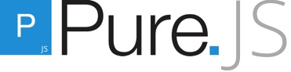

# Pure Components

Styled Component design system for React/Preact based on [Pure CSS](https://purecss.io), a set of small, responsive CSS modules that you can use in every web project.

## CSS with a minimal footprint.

Pure Components are ridiculously tiny. The entire set of modules clocks in at 90KB\* minified and gzipped. Crafted with mobile devices in mind, it was important to us to keep our file sizes small, and every line of JS was carefully considered. If you decide to only use a subset of these modules, you'll save even more bytes.

- Minimal - Only the components you need. Extend easily with styles to customize.
- Lightweight
- Modular

Want to prototype a quick app? Or just need a quick grid? We've got you covered with simple, responsive components `<Grid><Grid.Unit columns={[1/2,1/4]}>`.

## Components

- Base
- Button
- Form
- Grid
- Grid.Unit
- Menu
- Menu.Header
- Menu.Item
- Table

Check out [the documentation here](#) with each component, it's props, and examples on how to use them.

## Branches

- main - Pure CSS optimized
- theming - Example on how to setup components for theming

## Development

This project primarily uses StorybookJS for development.

### Quick Start

1. `git clone` this project
1. `npm install`
1. `npm run storybook` or `npm run dev`

### Building for Production

1. `npm run build`

This runs 3 separate Babel build processes that generates code for:

- **Browser** (CDN scripts) - `/dist/`
- **Node** (CommonJS modules) - `/module/`
- **ES6 Modules** (npm frontend code) - `/lib/`

You won't find these folder in this git repo, but you can generate them yourself by running the command above, or download them from a CDN like [unpkg](https://unpkg.com/pure-styled-components@latest)

### Release on NPM

1. Update `CHANGELOG.md`
1. Change version in `package.json` (per semver rules)
1. Login to npm CLI
1. Run `npm run release`

## Todo

### High Priority

- Install semver to handle versioning

### Low Priority

- Multi-layered dropdown display with keyboard input
- Tests
- Extra pages (Layouts, Customize/Theming/Extend)

## Credits

- [Pure CSS](https://purecss.io)
- [React Styleguidist](https://react-styleguidist.js.org/)
- [StorybookJS](https://storybook.js.org/)
- [styled-system](https://github.com/jxnblk/styled-system)
